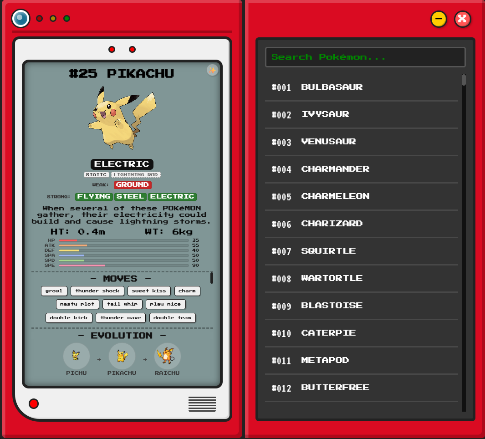

# pokedex-electron

[](https://www.npmjs.com/package/pokedex-electron)
[](https://www.npmjs.com/package/pokedex-electron)

A sleek, retro-style Pokédex desktop application built with **Electron**, **PokéAPI**, and modern CSS (Glassmorphism aesthetics).



## Installation & Usage

### Via NPM (Global Install)
You can install and run the Pokedex directly using NPM without cloning the repository:

1. **Install globally:**
   ```bash
   npm install -g pokedex-electron
   ```

2. **Run the application:**
   ```bash
   pokedex-electron
   ```

### From Source (Development)
1.  **Clone the repository:**
    ```bash
    git clone https://github.com/bariskisir/pokedex.git
    cd pokedex
    ```

2.  **Install dependencies:**
    ```bash
    npm install
    ```

3.  **Run the Electron application:**
    ```bash
    # This will launch the Pokedex as a desktop application
    npm start
    ```

## License

This project is open-source and available under the [MIT License](LICENSE).
