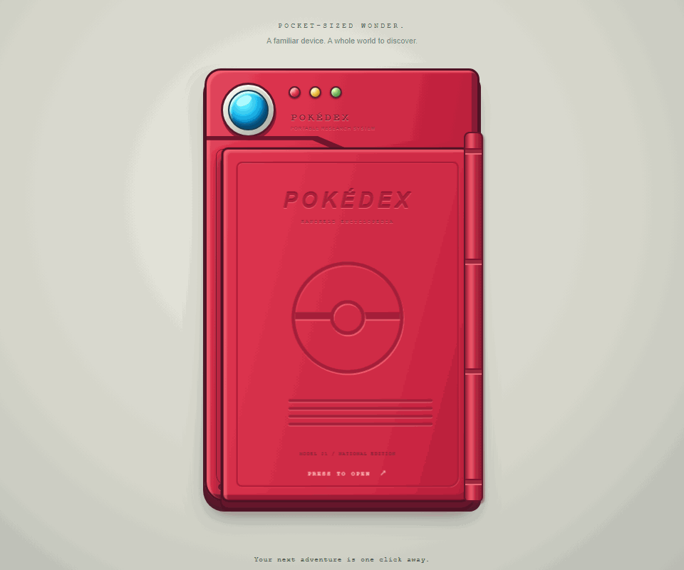

# pokedex-electron

[](https://www.npmjs.com/package/pokedex-electron)
[](https://www.npmjs.com/package/pokedex-electron)

A folding, handheld-style Pokédex built with **Electron**, **React**, **TypeScript**, **SCSS**, and [**PokéAPI v2**](https://pokeapi.co/docs/v2). Click the closed cover to unfold the device with animated screens and synthesized sound effects. Browse every available generation and alternate form, view generation/region labels, explore evolutions and type matchups, and save favorites locally.



## Installation & Usage

Requires **Node.js 24.15 or newer** and a desktop environment. Internet access is needed for uncached Pokémon data and media.

### Via NPX (Quick Start)

Run directly without a global installation:

```bash
npx pokedex-electron
```

Click the cover to open. The D-pad moves between Pokémon and information pages; the red switch closes the cover, and the round sound control mutes device audio. The desktop window fits the folded or open device, and animations respect reduced-motion preferences.

### Via NPM (Global Install)

Install and run the Pokédex without cloning the repository:

1. **Install globally:**
   ```bash
   npm install -g pokedex-electron
   ```

2. **Run the application:**
   ```bash
   pokedex-electron
   ```

### From Source (Development)

1.  **Clone the repository:**
    ```bash
    git clone https://github.com/bariskisir/pokedex.git
    cd pokedex
    ```

2.  **Install dependencies:**
    ```bash
    npm ci
    ```

3.  **Run the Electron application:**
    ```bash
    npm start
    ```

For the React development server with hot reload, run `npm run dev`. This previews the renderer in your browser; use `npm start` to test desktop integration.

Run `npm run check` for type checking, linting, formatting, and unit tests. To run browser, Electron, and installed-package tests:

```bash
npm run build
npx playwright install chromium
npm run test:e2e
npm run package:check
```

Linux desktop tests need a graphical session or Xvfb. The automated tests use API fixtures; to check the live service, run `npm run test:live` while the development server is running. To refresh the animation above, run `npm run preview:record` with the same server running.

Releases are published to npm by pushing a tag matching the version in both `package.json` and `package-lock.json`. For **2.0.0**, use either `v2.0.0` or `2.0.0`, not both. Validate the tag first with `npm run release:check -- v2.0.0`. The GitHub Actions workflow runs validation before publishing with npm provenance and the repository's `NPM_TOKEN` secret.

## License

This project is open-source and available under the [MIT License](LICENSE).
